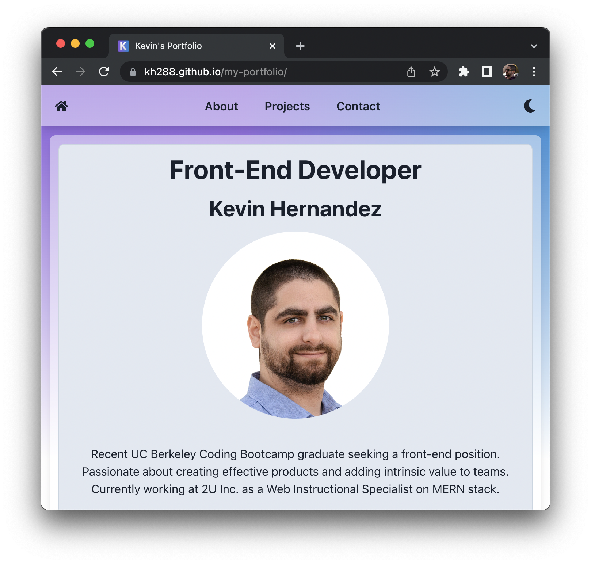

# My Portfolio

## Table of Contents

- [Description](#description)
- [Deployment](#deployment)
- [Description](#description)
- [Contact](#contact)
- [License](#license)

# Description

A typescript React portfolio to show off my current projects.
This simple site was also practice for typesciprt + chakra UI.

# Deployment

https://kh288.github.io/my-portfolio/

# Contact

#### [Github](https://github.com/kh288)

#### [Linkedin](https://www.linkedin.com/in/kevin-hernandez-5a8243167/)

kevin.hernandez288@gmail.com

# License

This project is protected under MIT license.
